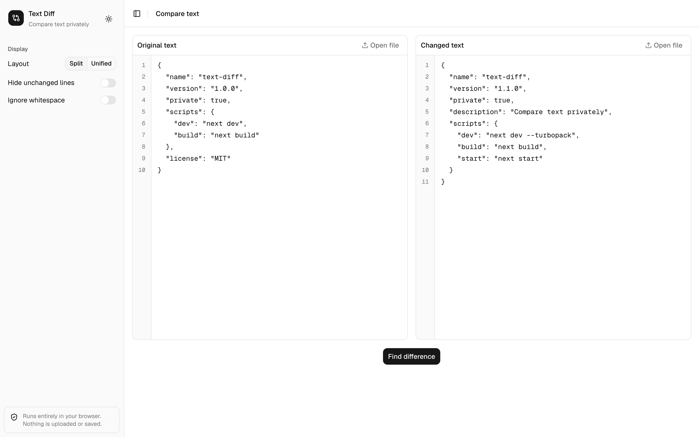
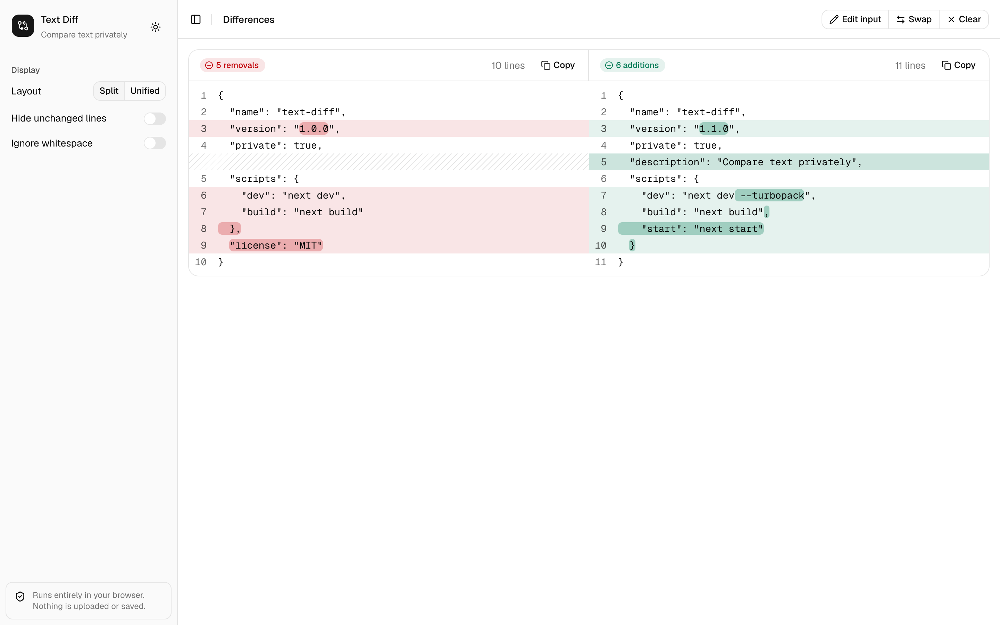
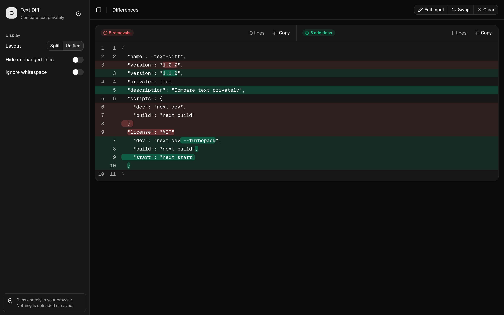

# Text Diff

Find the difference between two texts without handing them to a website.

Online diff checkers send what you paste to their servers, where it can be logged, stored or leaked. Text Diff runs entirely in your browser. Nothing is uploaded and nothing is saved, so it is safe for secrets, credentials, contracts and private notes.







## Run locally

```bash
bun install
bun dev
```

## Releases

Every push to `main` is released automatically from [Conventional Commits](https://www.conventionalcommits.org): `fix:` bumps the patch, `feat:` the minor and `feat!:` the major version. The current version and commit are shown in the sidebar.

## Built with

[Next.js](https://nextjs.org) · [shadcn/ui](https://ui.shadcn.com) · [jsdiff](https://github.com/kpdecker/jsdiff)

## License

[MIT](LICENSE)
