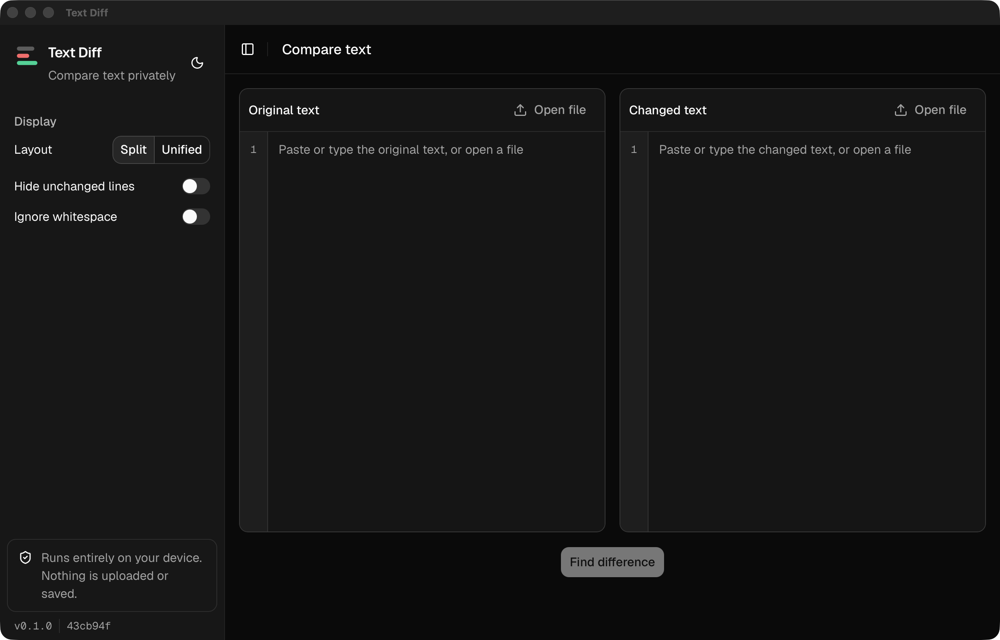
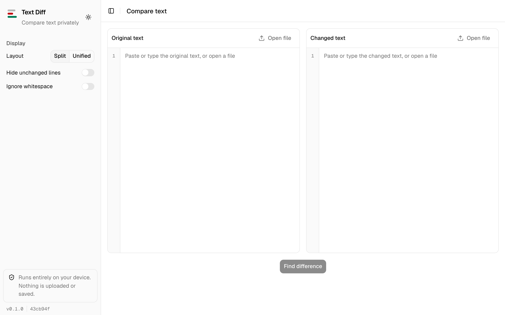
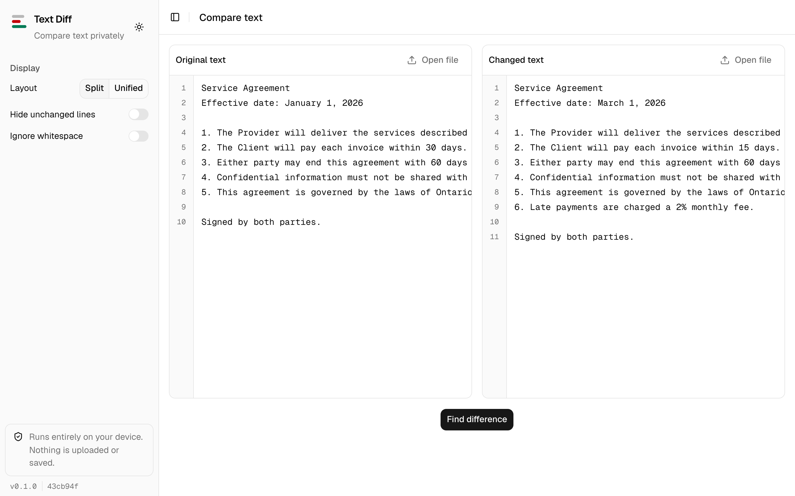
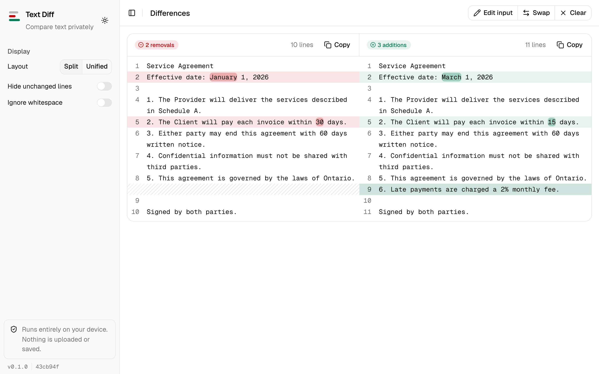
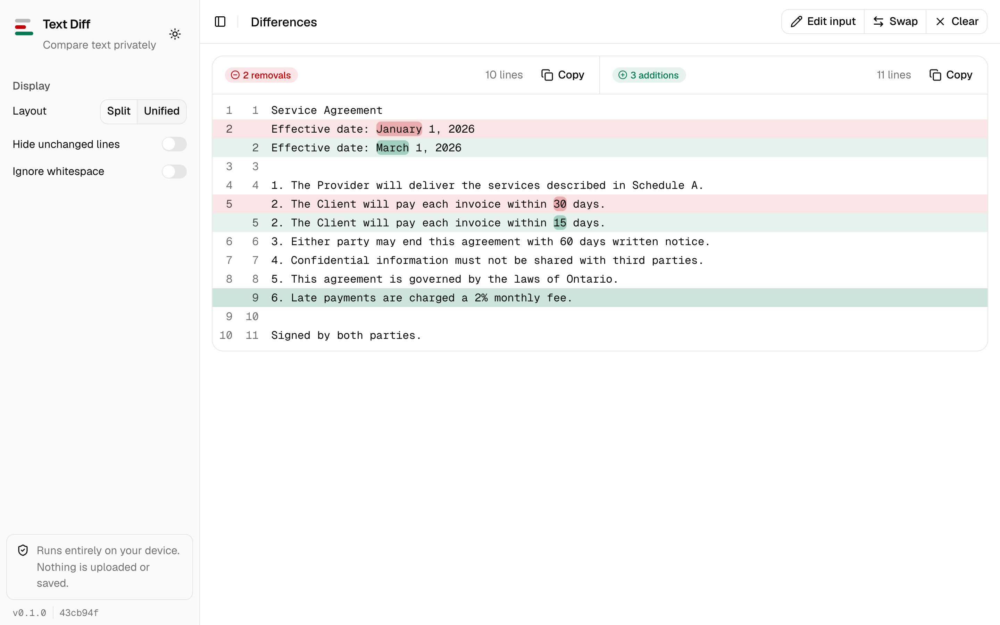
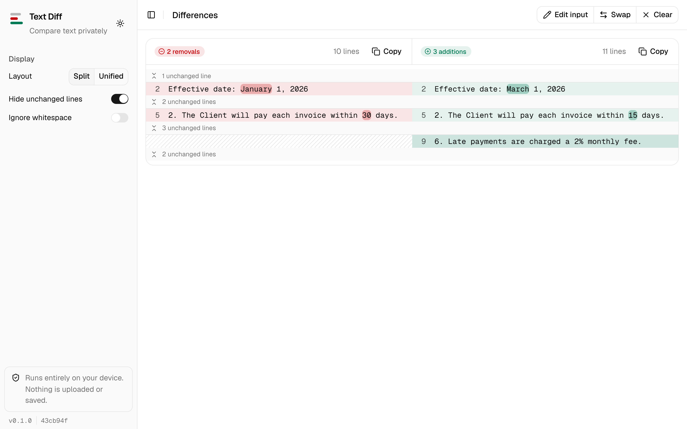
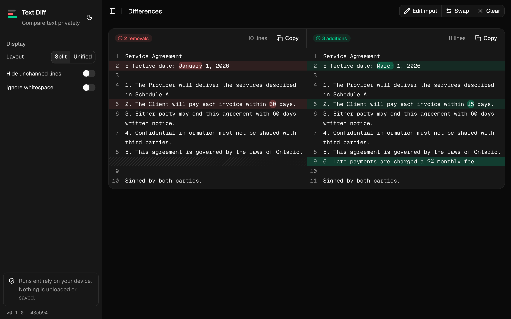
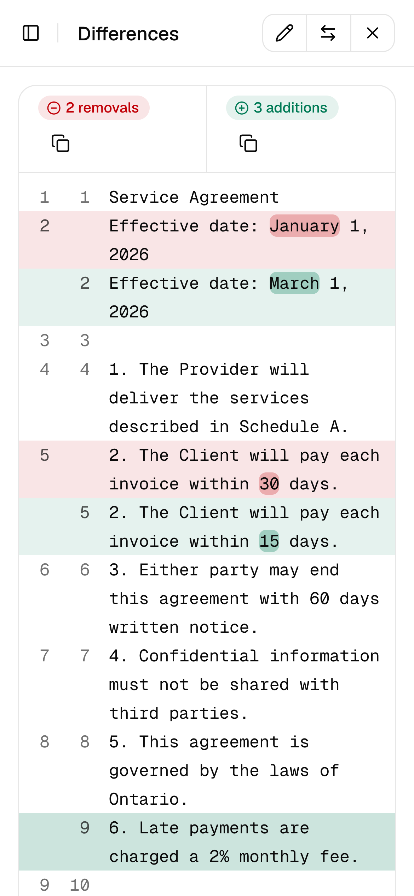

# Text Diff

Find the difference between two texts without handing them to a website.

Most online diff checkers send what you paste to their servers. There it can be saved, logged and, depending on their terms, shared with or sold to third parties such as advertisers. You have no way to check what happens to it.

Text Diff runs entirely on your device. Nothing is uploaded and nothing is saved, so it is safe for secrets, credentials, contracts and private notes.

## Download

- [macOS](https://github.com/faysal-alfaleh/text-difference-opensource/releases/latest/download/Text-Diff-macOS.dmg) (Apple Silicon and Intel)
- [Windows](https://github.com/faysal-alfaleh/text-difference-opensource/releases/latest/download/Text-Diff-Windows-setup.exe)

The apps are not code-signed yet. On macOS, right-click the app and choose **Open** the first time. On Windows, choose **More info → Run anyway**.



## How it works

**1. Open the app**



**2. Paste or open the two texts**



**3. Select Find difference**



**4. Switch to the unified view**



**5. Hide unchanged lines to focus on the changes**



**6. Use it in dark mode or on your phone**





## Run locally

```bash
bun install
bun dev
```

Desktop app: `bun run tauri dev` (requires [Rust](https://www.rust-lang.org/tools/install)).

## Releases

Every push to `main` is released automatically from [Conventional Commits](https://www.conventionalcommits.org): `fix:` bumps the patch, `feat:` the minor and `feat!:` the major version. Each release includes the macOS and Windows downloads. The current version and commit are shown in the sidebar.

## Built with

[Next.js](https://nextjs.org) · [shadcn/ui](https://ui.shadcn.com) · [Tauri](https://tauri.app) · [jsdiff](https://github.com/kpdecker/jsdiff)

## License

[MIT](LICENSE)
